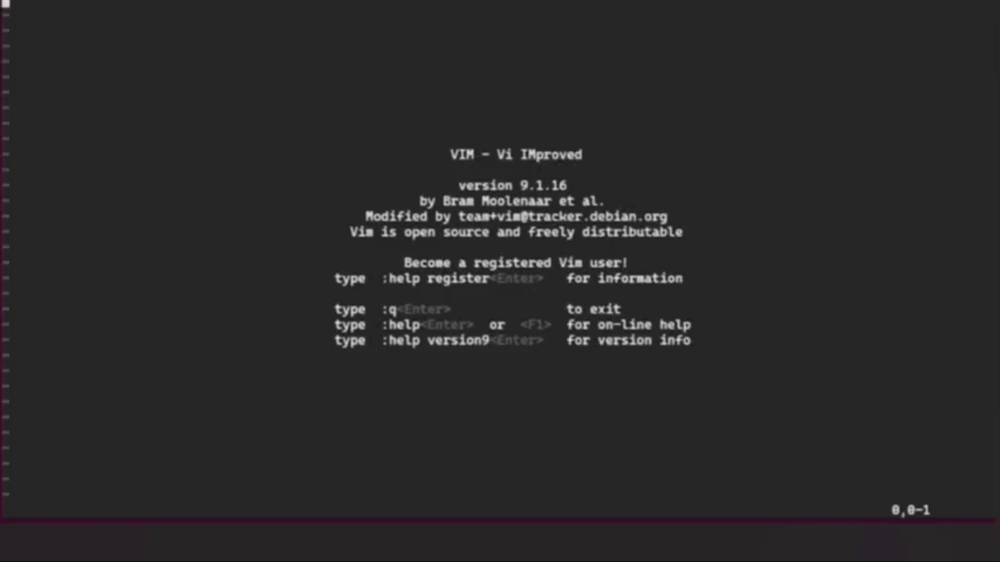

# 🧛🏻‍♂️ Gardenal



Gardenal is a plugin for Vim that allows you to create keyboard shortcuts to change themes, easy to install and simple to configure.

## How install? 

first you run the installer

``` shell
bash install.sh
```

then you configure it in your configuration file, like in this example:

``` vimscript
source ~/.vim/plugins/gardenal.vim

let themes = ['desert', 'gruvbox', 'monokai']
call MapThemeSwitcherKeys(themes)
nnoremap <silent> 1 :call ThemeSwitcher(themes, 1)<CR>
nnoremap <silent> 2 :call ThemeSwitcher(themes, 2)<CR>
nnoremap <silent> 3 :call ThemeSwitcher(themes, 3)<CR>
```

## Contribute

If you want to contribute to the project, just send a pull request and I will review the code and accept it. Please also send a detailed description of your changes or additions to the code.

## Contributors

This project exists thanks to all the people who contribute. 

<a href="https://github.com/BrunoCiccarino/gardenal/graphs/contributors">
  
</a>